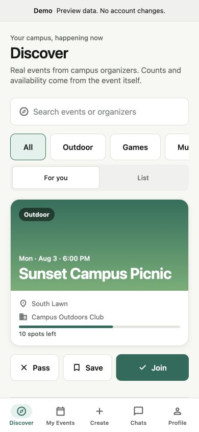
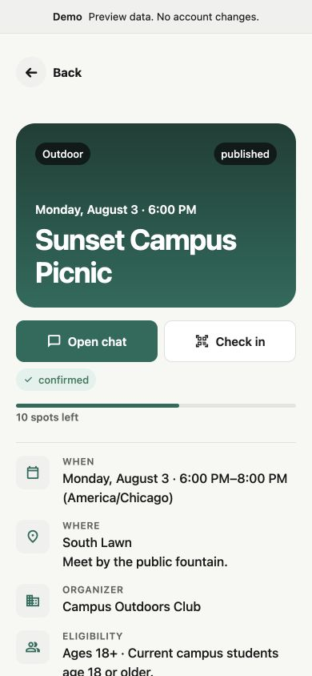
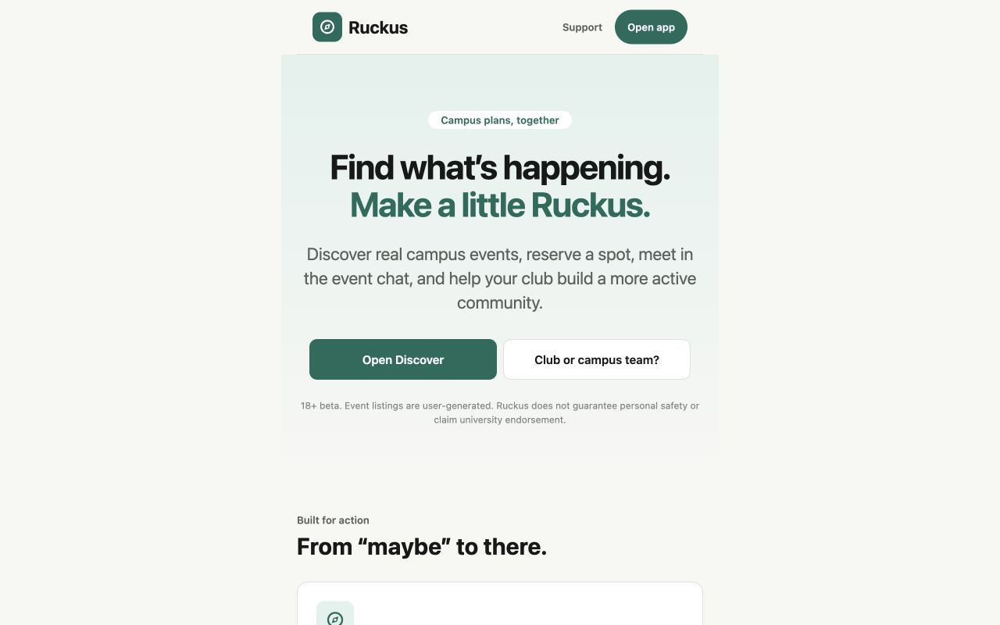

# Ruckus

**Swipe into something.** Ruckus is an 18+ campus events beta: verified students
discover events, RSVP with one swipe, join the private attendee chat when confirmed,
and earn server-controlled XP for verified participation. Clubs can manage events,
waitlists, announcements, rotating QR check-in, and scoped organization roles.

The repository also retains Ruckus Crews, the earlier small-group matching system, as
an optional activity flow. Ruckus is not a dating product and has no direct messages,
payments, anonymous chat, or live/background location tracking.

## Product surface

- Event-first Discover deck with accessible Join and Pass alternatives
- Transactional capacity, approval, cancellation, and ordered waitlist promotion
- My Events, public share pages, calendar export, event chat, and check-in status
- Optimistic private chat with retry, replies, bounded reactions, copy, report, removed
  content, deleted-user rendering, and event-ended read-only behavior
- Organizer creation preview, attendee review, announcements, cancellation, archive,
  share links, and 60-second rotating QR codes
- Organization ownership, scoped roles, invitations, removal, verification/claim review,
  event history, and audited role changes
- Server-owned XP, campus leaderboard opt-out, verified referrals, privacy controls,
  data-export requests, account deletion, reports, blocks, and admin moderation
- Unauthenticated product, event, organization, referral, support, partnership, safety,
  privacy-draft, terms-draft, and deletion-information pages
- Clearly labeled offline demo mode; staging/production configuration fails closed

## Product preview

These screenshots were captured from the local demo using the exported web bundle. The
data is synthetic and the images are product evidence, not physical-device or signed
native-build verification.

| Discover and RSVP                                                      | Event detail                                                             | Public landing                                                            |
| ---------------------------------------------------------------------- | ------------------------------------------------------------------------ | ------------------------------------------------------------------------- |
|  |  |  |

Generated phone-preview instructions and the broader visual acceptance matrix live in
[`docs/PHONE_PREVIEW.md`](docs/PHONE_PREVIEW.md) and
[`docs/VISUAL_QA.md`](docs/VISUAL_QA.md). Final App Store and Play Store captures remain
an owner/device gate.

## Stack and trust model

- Expo SDK 57, React Native 0.86, React 19.2, Expo Router, strict TypeScript
- Supabase Auth, Postgres, RLS, Storage, private Realtime, and Edge Functions
- TanStack Query, Expo Camera/Calendar/Notifications/Image/Secure Store
- Vitest, pgTAP, concurrency harnesses, ESLint, Prettier, Supabase CLI, GitHub Actions

The client is untrusted. Multi-row RSVP, waitlist, check-in, XP, referral, organization,
notification-claiming, and moderation transitions execute in reviewed database
functions. The service-role credential is Edge-Function-only. See
[`ARCHITECTURE.md`](ARCHITECTURE.md), [`SECURITY.md`](SECURITY.md), and
[`docs/RLS_AUTHORIZATION_MATRIX.md`](docs/RLS_AUTHORIZATION_MATRIX.md).

Node.js 22.13+ and Docker Desktop (or a compatible Docker runtime) are required for
connected local development.

## Local setup

```sh
npm ci
cp .env.example .env
npm run db:start
npm run db:reset
npx supabase status -o env
```

Copy only the local API URL and publishable/anonymous key into `.env`, then run:

```sh
npm run start:go       # web/Expo Go exploration where supported
npm run ios            # native development build
npm run android
```

With both Supabase client variables empty, development intentionally enters a labeled
demo. A partial configuration is an error. Staging and production builds require a
matching hosted project ref, project URL, publishable key, EAS project UUID, university
domain, and build target.

Local seed users use the unmistakably local password `RuckusLocal1!`:
`demo1@example.edu`–`demo6@example.edu`, `host@example.edu`, and
`admin@example.edu`. Never deploy `supabase/seed.sql` to a hosted project.

## Verification

```sh
npm run verify
npm run db:reset
npm run test:db
npm run test:event-capacity
npm run test:matching
npm run test:social-concurrency
npm run test:recommendations
npx expo export --platform web --output-dir dist/web
npx expo export --platform ios --output-dir dist/ios
npx expo export --platform android --output-dir dist/android
npx expo-doctor
npm audit
```

The concurrency scripts discover the local publishable key automatically unless one is
provided. CI repeats application verification, a clean database reset, pgTAP,
concurrency checks, Edge Function validation, exports, audit, and secret scanning.
Manual device/email/push/store checks are intentionally separate in
[`docs/DEVICE_QA.md`](docs/DEVICE_QA.md).

The recommendation architecture, privacy boundary, and offline metrics are documented
in [`docs/RECOMMENDATIONS.md`](docs/RECOMMENDATIONS.md).

## Edge Functions and deployment

Secrets such as `CHECKIN_TOKEN_PEPPER`, `CRON_SECRET`, `PARTNERSHIP_RATE_LIMIT_PEPPER`,
the Expo access token, and the Supabase service role never use `EXPO_PUBLIC_*`.
Deployment order, scheduler authentication, notification jobs, retry behavior,
partnership intake, and account purge are documented in
[`docs/OPERATIONS.md`](docs/OPERATIONS.md) and [`docs/DEPLOYMENT.md`](docs/DEPLOYMENT.md).

```sh
eas build --profile development --platform all
eas build --profile staging-development --platform ios
eas build --profile staging-development --platform android
```

No store submission, legal approval, production Supabase project, support address, or
privacy/deletion URL is claimed by this repository.

## Repository map

```text
app/                         Expo Router public, auth, onboarding, and protected routes
src/components/              Accessible UI primitives and product components
src/features/                Typed services, hooks, parsers, and explicit demo adapters
src/lib/                     Validated config, analytics, logging, deep links, storage
supabase/migrations/         Schema, trusted operations, RLS, Storage, Realtime
supabase/functions/          Authenticated/public-hardened/cron Edge Functions
supabase/tests/              Transactional pgTAP authorization and integrity tests
scripts/                     Real concurrency and preview verification
docs/                        Product, security, privacy, operations, QA, and release docs
```

## Status, contribution, and license

This is a prerelease beta candidate. Automated gates do not replace physical-device,
legal, accessibility-expert, abuse-operations, hosted-backend, or app-store review.
See [`docs/RELEASE_CHECKLIST.md`](docs/RELEASE_CHECKLIST.md) for the exact state.

Contributions follow [`CONTRIBUTING.md`](CONTRIBUTING.md) and the
[`CODE_OF_CONDUCT.md`](CODE_OF_CONDUCT.md). Security reports follow
[`SECURITY.md`](SECURITY.md). The repository is **UNLICENSED / all rights reserved**;
public visibility does not grant an open-source license.
